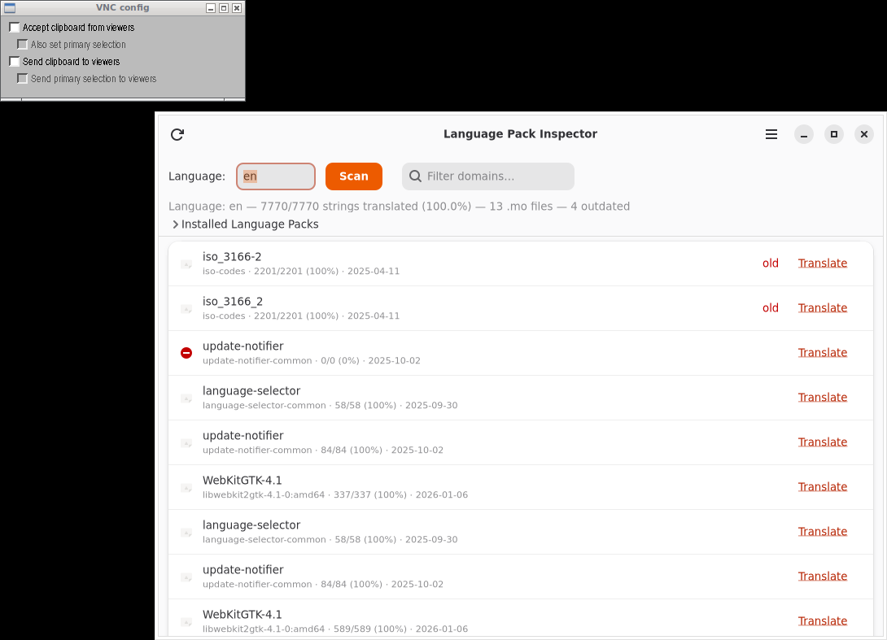

# Language Pack Inspector

A GTK4/Adwaita application for inspecting Ubuntu language pack coverage and .mo files.



## Features

- List installed language packs (`language-pack-*`)
- Show contents: which `.mo` files are included per package
- Compare with available templates on Launchpad
- Display translated/untranslated string counts per `.mo` file
- Flag old/outdated translations (by date comparison)
- Language chooser (defaults to system language)
- Statistics: total coverage per language
- Direct links to Launchpad for translating missing strings

## Installation

### Debian/Ubuntu

```bash
# Add repository
curl -fsSL https://yeager.github.io/debian-repo/KEY.gpg | sudo gpg --dearmor -o /usr/share/keyrings/yeager-archive-keyring.gpg
echo "deb [signed-by=/usr/share/keyrings/yeager-archive-keyring.gpg] https://yeager.github.io/debian-repo stable main" | sudo tee /etc/apt/sources.list.d/yeager.list
sudo apt update
sudo apt install langpack-inspector
```

### Fedora/RHEL

```bash
sudo dnf config-manager --add-repo https://yeager.github.io/rpm-repo/yeager.repo
sudo dnf install langpack-inspector
```

### From source

```bash
pip install .
langpack-inspector
```

## 🌍 Contributing Translations

This app is translated via Transifex. Help translate it into your language!

**[→ Translate on Transifex](https://app.transifex.com/danielnylander/langpack-inspector/)**

Currently supported: Swedish (sv). More languages welcome!

### For Translators
1. Create a free account at [Transifex](https://www.transifex.com)
2. Join the [danielnylander](https://app.transifex.com/danielnylander/) organization
3. Start translating!

Translations are automatically synced via GitHub Actions.
## License

GPL-3.0-or-later — Daniel Nylander <daniel@danielnylander.se>
